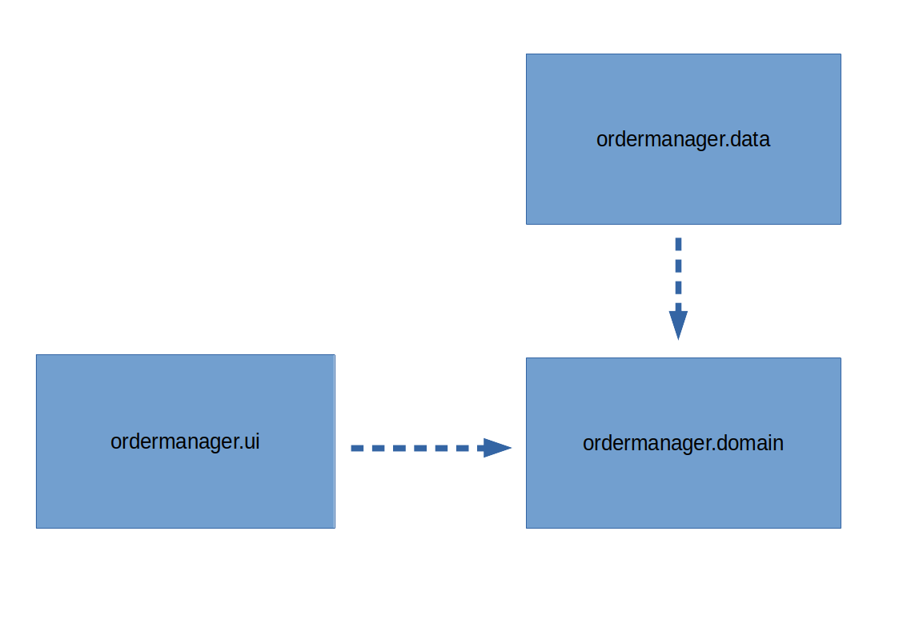
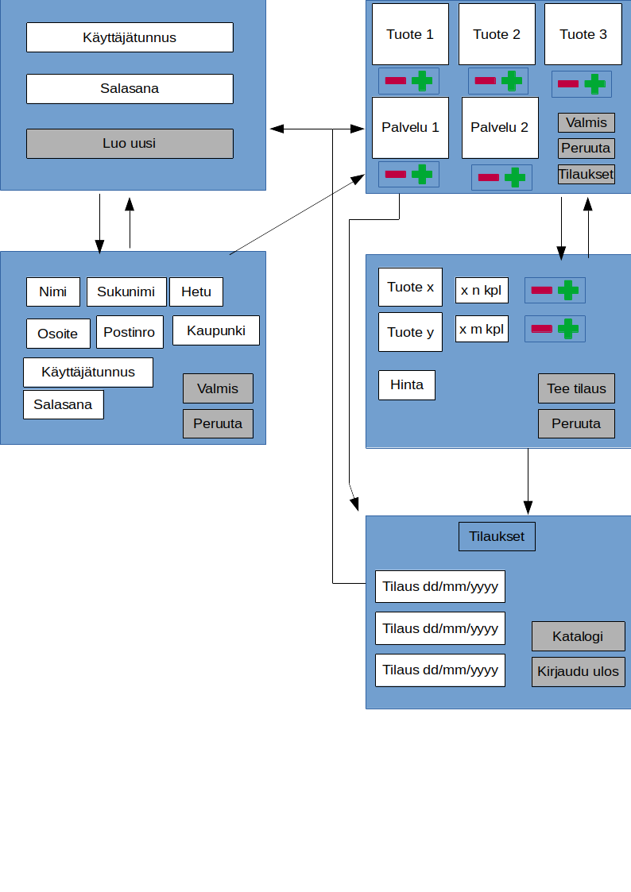

# **Arkkitehtuurikuvaus** #
## **Rakenne** ## 
 
Pakkaus ordermanager.ui sisältää JavaFX:llä toteutetun graafisen käyttöliittymän. Pakkaus ordermanager.domain puolestaan sisältää sovelluslogiikan ja ordermanager.data käyttäjien ja tuotteiden pysyväistallennuksen. 

## **Käyttöliittymä** ##

Käyttöliittymä sisältää viisi erilaista näykmää.
* kirjautuminen
* uuden käyttäjän luominen
* katalogi
* ostoskori
* tilaushistoria  

Näkymät ovat yksitellen näkyvissä. Näkymät toteutetaan Scene-oliona ja sijoitetaan sovelluksen stageen. Käyttöliittymän ohjelmallinen toteutus löytyy luokasta ordermanager.ui.OrdermanagerUi. 

## **Sovelluslogiikka** ## 
Käyttäjätilien toiminnallisuuksista vastaa userManagement-olio, joka hoitaa uusien käyttäjätunnuksien luomisen sekä tarkistaa syötettyjen kirjautumistunnusten oikeellisuuden. 

## **Tietojen pysyväistallennus** ## 
Käyttäjätunnukset ja tuotetiedot tallennetaan .csv tyyppiseen tiedostoon, eli esimerkiksi käyttäjän antamat tiedot on tallennettu kulloisellekin riville puolipisteellä ; eroteltuna. Tiedostot löytyvät ordermanager.data paketista.

## **Päätoiminnallisuudet** ##
### **käyttäjän kirjautuminen** ### 
Jos käyttäjä on aiemmin rekisteröitynyt käyttäjäksi, voi hän luomillaan tunnuksilla kirjautua suoraan katalogi näykmään.
Login-painiketta painamalla tapahtumankäsittelijä kutsuu userManagement-olion login-metodia antaen käyttäjän syötteet parametrina. UserManagement tarkistaa tietokannasta kirjautumistietojen oikeellisuuden ja palauttaa tilanteesta riippuen true tai false.
### **uuden käyttäjän luominen** ### 
Jos käyttäjällä ei ole aiempia tunnuksia, voi hän luoda uuden painamalla alkunäytöstä "Create new user" -nappia. Näkymän vaihduttua käyttäjä voi syöttää yhteystietonsa ja luoda uuden tunnuksen. Käyttöliittymä kutsuu userManagement-olion creaateNewUser-metodia, joka tarkistaa onko käyttäjätunnus vapaana. 
### **tuotteiden valitseminene** ###
Kun käyttäjä on saanut toimivat tunnukset ja päässyt kirjautumaan sisään, voi hän alkaa valita tuotteita ostoskoriin. Katalogissa on näkymä tuotteista, joissa kaikkissa on toiminnallisuus ostoskoriin lisäämiseksi tai poistamiseksi.
