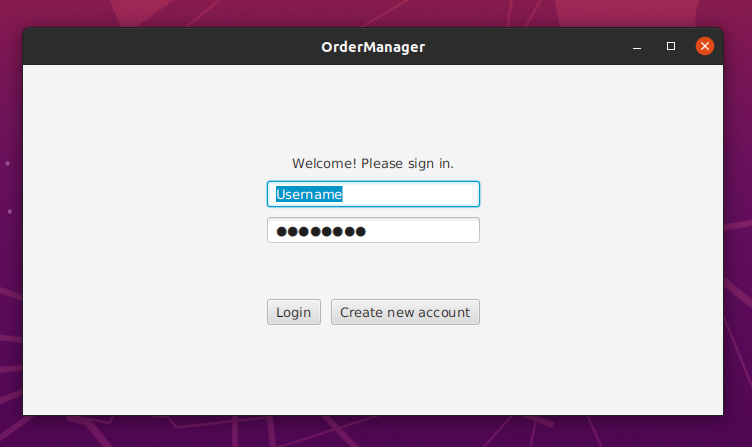
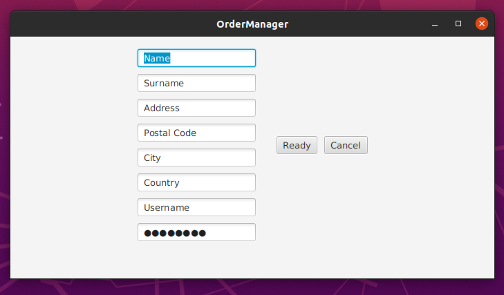
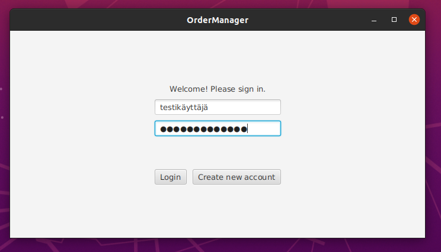
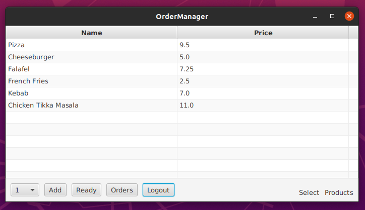
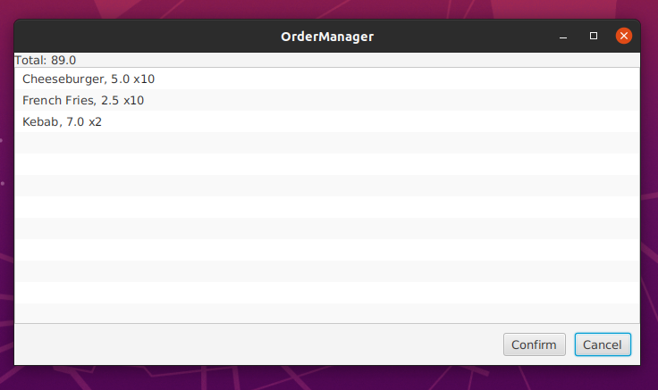
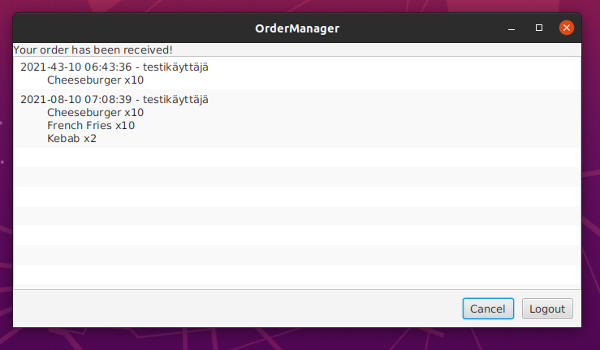
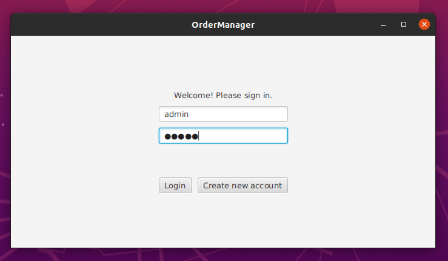
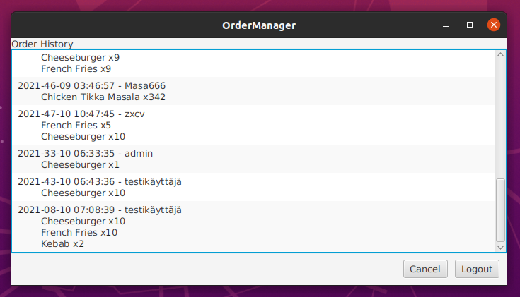

# **Käyttöohje**
lataa tiedosto ordermanager.jar
## **Ohjelman käynnistäminen**
Ohjelma käynnistyy komennolla
```
java -jar ordermanager.jar 
```
## **Aloitus** 
Aloitus näytöstä voi joko kirjautua suoraan palveluun syöttämällä käyttäjätunnus sekä salasana ja painamalla *Login*, tai luoda uuden käyttäjän painamalla *Create new account*.



## **Uuden käyttäjän luominen**
Uuden käyttäjätunnuksen voi luoda syöttämällä vaaditut tiedot kyseisiin kenttiin ja painamalla *ready*. Käyttäjänimen tulee olla ainutlaatuinen ja postinumeron numeerinen. Lisäksi syötteet eivät saa sisältää puolipisteitä. Näkymästä voi myös peruuttaa aloitusnäkymään painamalla *Cancel*.

 

## **Sisäänkirjautuminen ja tuotevalikko**
Kun uusi käyttäjä on luotu, voit kirjautua sisään aloitusnäytöstä syöttämällä käyttäjätunnuksen sekä salasanan. Oikeilla tunnuksilla sovellus kirjautuu tuotevalikkoon painamalla *Login*. 



Tuotevalikossa on listattuna tuotteita ja niiden hintoja. Tuotteita voi lisätä ostoskoriin valitsemalla ensin tuotteen ja painamalla sitten *Add*. Valittavien tuotteiden määrä on alustavasti yksi, mutta määrän voi vaihtaa alareunasta löytyvästä pudotusvalikosta. 
Tuotteita on mahdollista järjestää aakkos- ja hintajärjestykseen klikkaamalla kyseisen sarakkeen otsikosta. 
Kun tuotevalinnat on tehty, voi ostoskorin sisältöä tarkastella painamalla *Ready*. 

 

Näkymästä voi myös hypätä suoraan tarkastelemaan omia tilauksia painamalla *Orders* tai kirjautua ulos painamalla *Logout*. 
## **Ostoskori ja tilauksen vahvistaminen** 
Ostoskori näyttää tuotevalikoimasta tehdyt valinnat määrineen ja hintoineen. Näkymän ylälaidassa näkyy tämänhetkisen tilauksen kokonaishinta. 
Ostoskoriin on mahdollista lisätä tuotteita palaamalla tuotevalikoimaan painamallla *Cancel*. Ostoskorin sisältö pysyy tallessa kunnes käyttäjä hyväksyy tilauksen tai kirjautuu ulos. 



Ostoskori näykmästä tilaukesn voi vahvistaa painamalla *Ready*, jolloin sovellus siirtyy tilaushistoria näkymään. 
Tässä näkymässä on listattuna kirjautuneen käyttäjän tilaushistoria, joista viimeisin tilaus löytyy alimpana. 



Tilaushistoria näkymästä voi palata tuotevalikoimaan painamalla *Cancel* tai kirjautua ulos painamalla *Logout*. 
## **Admin**
Admin-käyttäjällä on mahdollista tarkastella kaikkien käyttäjien tekemiä tilauksia. Adminilla pääsee kirjautumaan kun syöttää sekä käyttäjätunnukseen että salasanaan admin.



Kataloginäkymästä voi siirtyä tilaushistoriaan Orders-nappia painamalla. 
Muilla käyttäjillä tilaushistoria näyttää vain kyseisen käyttäjän tekemät tilaukset, mutta admin-käyttäjällä näkymään listautuu kaikki vahvistetut tilaukest. 

 

