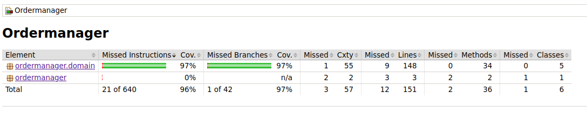

# **Testausdokumentti** #
Ohjelmassa käytetään JUnit tyyppisiä yksikkö- ja integraatiotestejä. Lisäksi järjestelmätason testaus on suoritettu manuaalisesti. 

## **Yksikkö- ja integraatiostestaus** 
### **sovelluslogiikka**
Pakkauksen ordermanager.domain luokkia testaavat 
* [OrderManagementTest](../Ordermanager/src/test/java/ordermanager/domain/OrderManagementTest.java)  
* [ProductManagementTest](../Ordermanager/src/test/java/ordermanager/domain/ProductManagementTest.java) 
* [ProductTest.java](../Ordermanager/src/test/java/ordermanager/domain/ProductTest.java) 
* [UserManagementTest](../Ordermanager/src/test/java/ordermanager/domain/UserManagementTest.java) 
* [UserTest.java](../Ordermanager/src/test/java/ordermanager/domain/UserTest.java) 

## **Testauskattavuus** ##
Käyttöliittymää lukuunottamatta testikattavuus on 96% ja haarautumiskattavuus 97%.
 
Testaamatta jäivät tilanteetn, joissa käyttäjiä tai tilauksia tallentavia tiedostoja ei löydy tai niihin ei ole pääsyä. 

## **Järjestelmätestaus**
Järjestelmätestaus on suoritettu manuaalisesti. 

### **Asennus**
Sovellus on testattu käyttöohjeiden mukaisesti Linux-ympäristössä.

### **Toiminnallisuudet** 
Sovelluksen kaikki toiminnallisuudet on käyty manuaalisesti läpi. Uutta käyttäjää on yritetty luoda virheellisillä syötteillä ja käytetyllä käyttäjätunnuksella.

