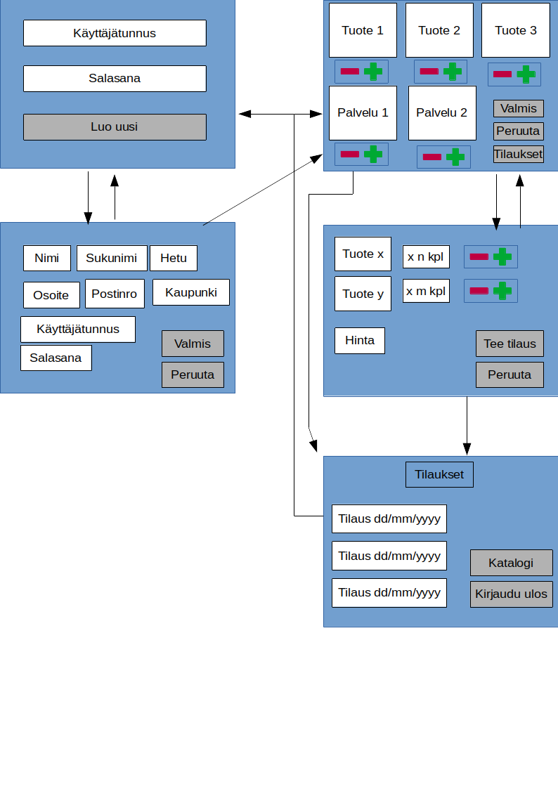

# **Vaatimusmäärittely** 
## **Sovelluksen tarkoitus** 
Sovelluksen avulla yrittäjä voi tarkkailla asiakkaiden tekemiä tilauksia.
Asiakkailla on puolestaan mahdollisuus tehdä tilaus yrittäjän tarjoamista tuotteista. 
## **Käyttäjät** 
Sovelluksen käyttäjiä ovat yrittäjä ja asiakkaat. 
## **Käyttöliittymäluonnos** 

## **Perusversion tarjoama toiminnallisuus** 
Sovelluksen tarjoamat tominnallisuudet: 
- [x] Uusi käyttäjä voi rekisteröityä palveleuun. 
- [x] Sovellus tallentaa uuden käyttäjän tunnukset ja yhteystiedot. 
- [x] Sovelluksella on tuotevalikoima ja sitä pääsee selaamaan graafisessa käyttöliittymässä.
- [x] Rekisteröitynyt käyttäjä voi valita tuotteita tuotevalikoimasta ostoskoriin.  
- [x] Ostoskorin sisällön voi tarkistaa ennen tilauksen tekoa. 
- [x] Vahvistettu ostoskorin sisältö kirjataan tilaukseksi. 
- [x] Käyttäjä pääsee tarkastelemaan omaa tilaushistoriaa.
- [x] Yrittäjä pääsee tarkastelemaan kaikkien tilausten tilaushistoriaa. 

## **Jatkokehitysideoita** 
Yritääjälle voisi luoda mahdollisuuden muokata katalogin sisältöä. 
Graafisen käyttöliittymän ulkoasua voisi ehostaa.

